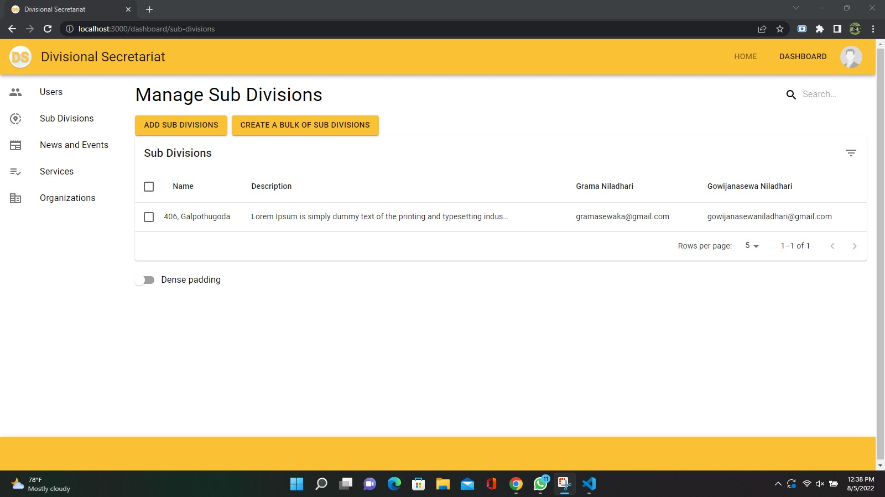

# Divisional Secretariate Backend and Admin App

A mobile app and a admin app to introduce a new concept for the future Sri Lanka which is rich in information and communication technology field. This project is for the people to contact with officers in divisional secretariat in their area, such as Gramasewaka, and get information and notifications from them.

## Description

A React JS admin app and a NodeJS backend app for the 1st part of final year project. The authentication part and push notification part is implemented with Firebase and Mongo DB is used as the database. This admin app can manage all the users, events, news and many other things. This app is for the divisional secretariat admins.

## Getting Started

### Dependencies

- For backend
  - axios@^0.26.1,
  - body-parser@^1.19.2
  - cors@^2.8.5,
  - dotenv@^16.0.0,
  - express@^4.17.3,
  - firebase-admin@^10.0.2,
  - mongoose@^6.2.9,
  - morgan@^1.10.0,
  - multer@^1.4.4,
  - nodemon@^2.0.15,
  - socket.io@^4.4.1
- For admin app
  - @emotion/react@^11.9.0
  - @emotion/styled@^11.8.1
  - @mui/icons-material@^5.10.2
  - @mui/lab@^5.0.0-alpha.77
  - @mui/material@^5.6.0
  - @mui/styles@^5.6.0
  - @testing-library/jest-dom@^5.16.4
  - @testing-library/react@^12.1.4
  - @testing-library/user-event@^13.5.0
  - axios@^0.27.2
  - firebase@^9.9.3
  - moment@^2.29.2
  - react@^18.0.0
  - react-dom@^18.0.0
  - react-material-ui-carousel@^3.4.2
  - react-redux@^8.0.2
  - react-router-dom@^6.3.0
  - react-scripts@5.0.0
  - redux@^4.2.0
  - web-vitals@^2.1.4

### Installing

- Clone the project

  ```
  git clone https://github.com/SandeepKushajVithanage/DivisionalSecretariateBackend.git

  cd DivisionalSecretariateBackend
  ```

- Setup the envirnment variables
  - /.env
  ```
  PORT=8000
  DATABASE_URL=<type mongo db url here>
  FILE_STORAGE=http://localhost:8000 # if you have seperate file storage, replace it here
  ```
  - /frontend/.env
  ```
  PORT=3000
  FILE_STORAGE=http://localhost:8000 # if you have seperate file storage, replace it here
  ```
- Installing the dependancies (from project root directory)
  - ```
      yarn install
    ```
  - ```
      cd frontend
      yarn install
    ```

### Executing program

- For backend (from project root directory)
  ```
    yarn dev
  ```
- For frontend admin app (from project root directory)
  ```
    cd frontend
    yarn start
  ```

## Authors

- SandeepKushajVithanage (sandeepkushaj3@gmail.com)

## Version History

- 1.0.0
  - Initial Release For Testing

## Screenshots

- Home Screen
  
- Sign In Screen
  
- Dashboard Users Screen
  
- Add User Screen
  
- Dashboard Sub Divisions Screen
  
- Add Sub Division Screen
  
- Dashboard Events Screen
  
